# Dynamic Menu Pricing

<p align="center">
  <!-- Build, quality & compliance -->
  <a href="https://github.com/ahmedshahriar/restaurant-menu-pricing/actions/workflows/ci.yml">
    
  </a>
  <a href="https://codecov.io/gh/ahmedshahriar/restaurant-menu-pricing">
    
  </a>
  <a href="https://docs.astral.sh/ruff/">
    
  </a>
  <a href="LICENSE">
    
  </a>
</p>

<p align="center">
  <!-- Runtime & key platform -->
  
  <a href="https://azure.microsoft.com/products/machine-learning/">
    
  </a>
  <a href="https://mlflow.org/">
    
  </a>
  <a href="https://www.kaggle.com/datasets/ahmedshahriarsakib/uber-eats-usa-restaurants-menus">
    
  </a>
</p>


Predict menu item prices from **UberEats** at scale — end-to-end: crawl → warehouse → curated dataset → ML model train/tune → register → blue/green deploy on Azure ML → managed via Azure APIM. Developer-friendly CLIs and MLOps guardrails.

#### 🎥 Demo: MVP Streamlit Front-End (via Azure API Management → Azure ML Endpoint)
> A lightweight Streamlit interface demonstrating end-to-end scoring through APIM and Azure ML.

[Watch the demo](https://github.com/user-attachments/assets/d5c3e52b-88ec-4378-800e-5477ef6d0ff5)


---

## Table of Contents
- [Why this project? (Business Problem → Solution)](#why-this-project-business-problem--solution)
- [System Architecture](#system-architecture)
- [Project Structure (overview)](#project-structure)
- [Data & Feature Engineering](#data--feature-engineering)
- [Quickstart](#quickstart)
  - [Prerequisites](#prerequisites)
  - [Local Setup](#local-setup)
  - [Common Environment Variables](#common-environment-variables)
- [Run with Docker (Optional Setup)](#run-with-docker)
- [How to Run (by task)](#how-to-run-by-task)
  - [1) Crawl / ETL](#1-crawl--etl)
  - [2) Export DWH](#2-export-dwh)
  - [3) Generate Training Sample](#3-generate-training-sample)
  - [4) Model Train, Tune & Register](#4-model-train-tune--register)
  - [5) Model Serve (MLflow)](#5-model-serve-mlflow)
  - [6) Azure ML: Blue/Green Deploy & Autoscale](#6-azure-ml-bluegreen-deploy--autoscale)
  - [7) Traffic, Canary, Promote/Rollback](#7-traffic-canary-promoterollback)
  - [8) Proxy API via Azure API Management](#8-proxy-api-via-azure-api-management)
  - [9) Proxy Scoring API (FastAPI)](#9-proxy-scoring-api)
- [Quality: Lint, Tests, Coverage](#quality-lint-tests-coverage)
- [Operational Notes & Best Practices](#operational-notes--best-practices)
- [Roadmap](#roadmap)
- [Disclaimer](#disclaimer)
- [Acknowledgments](#acknowledgments)
- [License](#license)

---

## Why This Project (Business Problem → Solution)

### Business Problem

Delivery platforms list millions of menu items across global markets, often with inconsistent or missing prices. Accurate price estimation enables:

* New-market bootstrapping and cold-start pricing
* Competitor analysis and revenue forecasting
* Discount/surge experimentation with model-based expectations

### Solution

This repository provides a **production-grade menu price prediction service**, integrating **data engineering**, **machine learning**, and **MLOps** workflows.

#### Data Engineering

* **ETL**: Scrapy pipelines crawl UberEats and store normalized restaurant data in **MongoDB Atlas (DWH)**
* Automated **GitHub Actions (cron)** for data ingestion, logging, and error handling
* Curated datasets exported to **Kaggle** ([`dataset link`](https://www.kaggle.com/datasets/ahmedshahriarsakib/uber-eats-usa-restaurants-menus)) for reproducible ML experiments

#### Machine Learning

* Reproducible data sampling and feature engineering (scikit-learn, HF Transformers, published Kaggle datasets)
* **Optuna**-based hyperparameter optimization across multiple model families (tree-based, linear, gradient boosting etc.)
* Experiment tracking, logging, model registry, and model versioning via **MLflow** on **Azure ML**.

#### MLOps

A production-ready deployment stack on **Azure ML**, emphasizing reliability, scalability, and observability.

* **Model Deployment**

  * Blue/Green or Canary rollout via **Azure ML Managed Online Endpoints** (supports traffic-splits between deployments)
  * Infrastructure provisioned and autoscale rules defined via **Azure IaC templates (ARM/Bicep)**

* **Monitoring & Autoscaling**

  * **Azure Monitor Autoscale** dynamically adjusts compute resources based on traffic and resource use
  * **Application Insights** and **Log Analytics** track latency, throughput, error rates and enable alerting

* **Access Layer**

  * Secure access to the endpoint via **Azure API Management (APIM)** or a **FastAPI proxy** (`services/api`)
  * Client UI built using **Streamlit** (`services/ui`)

* **Operations & Reliability**

  * Automated smoke tests, canary traffic shift workflows and rollback mechanisms during deployments
  * CLI utilities and Azure CLI scripts for endpoint management, rollout/promote/rollback and full lifecycle automation

---

## System Architecture

```mermaid
flowchart TB
%% ---- styles ----
classDef stage fill:#f9f9f9,stroke:#888,stroke-width:1px,corner-radius:4px,color:#111;
classDef node fill:#fff,stroke:#444,stroke-width:1px,corner-radius:4px,color:#000;
classDef faint fill:#f3f4f6,stroke:#7a869a,color:#1f2937;
classDef optional stroke-dasharray: 3 3,stroke:#888,color:#111,fill:#fafafa;

  subgraph Ingestion["**Ingestion**"]
    CRAWL["Web Crawlers (Scrapy)"]:::node --> DWH[(MongoDB Atlas DWH)]:::node

    SCHED["Orchestrator<br/>(GitHub Actions · cron)"]:::faint
    SCHED -. triggers .-> CRAWL
  end

  subgraph Feature_Engineering["<div style="width:21em; height:8em; display:flex;"><b>Feature Engineering</b></div>"]
    DWH --> EXPORT["Publish Dataset<br/>(Kaggle)"]:::node
    EXPORT --> FE["Feature Engineering<br/>• Data cleaning<br/>• Ingredient extraction (RoBERTa)<br/>• Feature augmentation"]:::node
    FE --> SAMPLE[Reproducible Training Sample]:::node
  end

  subgraph ML_Modelling["<div style="width:15em; height:8em; display:flex;"><b>ML Modelling</b></div>"]
    SAMPLE --> TRAIN["Model Training & Hyperparameter Tuning<br/>(scikit-learn pipeline · Optuna · MLflow Tracking)"]:::node
    TRAIN --> CMP["Model Comparison & Evaluation<br/>(Cross Validation)"]:::node
    CMP --> REG["Model Registry<br/>(Azure ML · best model promotion)"]:::node

    %% AML["Azure ML Jobs + Compute"]:::faint
    %% AML -. runs on .-> TRAIN
    %% AML -. runs on .-> CMP
  end

  %% --- Serving ---
  subgraph Serving["<div style="width:18em; height:8em; display:flex;"><b>Serving (Azure ML)</b></div>"]
    REG --> BLUE["Blue Deployment"]:::node
    REG --> GREEN["Green Deployment"]:::node

    BLUE --> ENDPT[Managed Online Endpoint]:::node
    GREEN --> ENDPT

    ENDPT -->|autoscale| MON[Azure Monitor Autoscale]:::node
    ENDPT -. telemetry .-> OBS["Observability<br/>(App Insights, Log Analytics, Alerts)"]:::faint

    CANARY["Canary Controller"]:::faint
    CANARY -. manages rollout .-> ENDPT
  end

  %% --- Access ---
  subgraph Access["**Access**"]
    ENDPT -->|expose| ACCESS[(Access Layer)]:::node

    ACCESS --> APIM[Azure API Management]:::optional
    ACCESS --> PROXY["Proxy API (FastAPI)"]:::optional

    APIM --> UI[Streamlit UI / Clients]:::node
    PROXY --> UI

    APIM -. telemetry .-> OBS
  end

  class Ingestion,Feature_Engineering,ML_Modelling,Serving,Access stage;

```



---

## Project Structure

Here is the directory overview:

```
.
├─ .github/workflows/       # CI/CD: QA and Test workflow, publish to GHCR, scheduled crawler runs
├─ application/             # Dataset utilities, preprocessing, and model-ready features
│  ├─ config/               # Global bootstrap, runtime config
│  ├─ dataset/              # DWH export, sampling, and I/O pipelines
│  ├─ networks/             # Singleton class to manage HF NER pipeline instance
│  └─ preprocessing/        # Dataset schema and preprocessing utilities
├─ bot/                     # Web crawlers (Scrapy spiders) for menu/restaurant data
├─ core/                    # Global constants, and config registry
├─ infrastructure/
│  ├─ azure/                # Azure IaC templates for ML endpoints and autoscale
│  │  ├─ endpoints/         # Blue/green deployment specs and smoke tests
│  │  └─ scale/             # Autoscale ARM templates
│  ├─ db/                   # MongoDB singleton client wrapper
│  └─ docker/               # MLflow model serving Dockerfiles
├─ model/                   # Model training, tuning, evaluation, and registry
├─ notebooks/               # EDA, ML, and deep-learning experiments (jupyter notebooks)
├─ pipelines/               # Orchestration (autotune, export)
├─ scripts/                 # Azure MLOps automation
│  ├─ deploy/               # Deploy blue/green endpoints
│  ├─ endpoint/             # Manage endpoints
│  ├─ infra/                # Provision/delete Azure resources
│  ├─ scale/                # Apply autoscale rules
│  └─ traffic/              # Manage traffic splits, canary rollout, promote/rollback, status
├─ services/
│  ├─ api/                  # FastAPI microservice (proxy to Azure ML scoring endpoint; own Dockerfile & pyproject)
│  └─ ui/                   # Streamlit UI
├─ tests/                   # tests
├─ tools/                   # Utility scripts for CLI entrypoints
│  ├─ run.py                # Main CLI entrypoint
│  └─ serve.py              # MLflow model serving CLI
├─ Dockerfile               # Main Application runtime
├─ Dockerfile.tools         # Azure CLI utilities
└─ pyproject.toml           # Project metadata and Poe tasks

```

---


## Data & Feature Engineering

### Datasets
Model training is based on a curated dataset exported from the UberEats web-crawling pipeline, enriched with auxiliary city and cost-of-living data.

- **UberEats Crawled Data** — collected via Scrapy, stored in MongoDB Atlas, and published to Kaggle:
  [Uber Eats USA Restaurants (63K+) & Menus (5 Million+) Dataset](https://www.kaggle.com/datasets/ahmedshahriarsakib/uber-eats-usa-restaurants-menus) - contains 63K+ U.S. restaurants and 5M+ menu items with names, categories, prices, locations, and descriptions.

<details>
  <summary>Dataset Overview (click to expand)</summary>

1. restaurants.csv (63K+ entries, 11 columns)
   - id (Restaurant id)
   - position (Restaurant position in the search result)
   - name (Restaurant name)
   - score (Restaurant score)
   - ratings (Ratings count)
   - category (Restaurant category)
   - price_range (Restaurant price range - `$` = Inexpensive, `$$` = Moderately expensive, `$$$` = Expensive, `$$$$` = Very Expensive)
   - full_address (Restaurant full address)
   - zip_code (Zip code)
   - lat (Latitude)
   - long (Longitude)
2. restaurant-menus.csv (5 Million+ entries, 5 columns)
   - restaurant_id (Restaurant id)
   - category (Menu category)
   - name (Menu Name)
   - description (Menu description)
   - price (Menu price)

</details>

- **Auxiliary Data** — used for geographic and economic feature enrichment:
  - **Cost of Living Index:** [Cost of living – bestplaces.net](https://www.bestplaces.net/cost-of-living/)
    - The extracted cost of living index for the shortlisted states/cities (5 states, 25 cities) is provided in the `extras/data` directory.
  - **Population Density:** [United States Cities Database](https://www.kaggle.com/datasets/sergejnuss/united-states-cities-database)

> [!NOTE]
> To capture how menu prices vary with location, I explored socio-economic factors such as **population density** and **cost of living** in the U.S.
> The United States Cities Database (2022) includes population density alongside `city` and `state_id` fields, enabling the selection of **5 state–city combinations** (25 cities total).
> Since no single public dataset covered cost-of-living indices for all restaurants, I manually extracted cost-of-living data for these shortlisted cities from [bestplaces.net](https://www.bestplaces.net/cost-of-living/), which is included under `extras/data/`.
> See `notebooks/uber-eats-EDA.ipynb` for detailed exploration and feature correlation analysis.

> Dataset generation and sampling logic lives under `application/dataset/`.

---

### Ingredient NER (Feature Engineering)

To extract structured information from menu text, a Hugging Face NER model ([`InstaFood RoBERTa-NER`](https://huggingface.co/Dizex/InstaFoodRoBERTa-NER)) identifies ingredients, portion sizes, and modifiers.
These parsed entities serve as structured features that strengthen the model’s price prediction signal.

- Implementation: `application/networks/` (NER singleton wrapper) and `application/preprocessing/` (feature builders)

### Notebooks

All exploratory and experimental work is documented in the `notebooks/` directory:

- **`notebooks/uber-eats-EDA.ipynb`** - Exploratory Data Analysis (EDA), Feature Engineering, NER-based ingredient extraction, BERT embeddings generation, and feature export for model training
- **`notebooks/uber-eats-ML.ipynb`** - Traditional ML experiments (e.g., linear, tree-based models) with Optuna tuning and cross-validation
- **`notebooks/uber-eats-deep-learning.ipynb`** - TensorFlow/Keras models for price prediction using BERT ingredient embeddings generated from EDA notebook

---

## Quickstart

### Prerequisites

* Python **3.11** (project targets 3.11)
* [Poetry](https://python-poetry.org/) & [Poe the Poet](https://github.com/nat-n/poethepoet) plugin (auto-installed via `pyproject`)
* MongoDB (for DWH), or a managed MongoDB Cloud (Atlas)
* **Kaggle API** creds for downloading published exports (`~/.kaggle/kaggle.json` or use env vars)
* **Azure CLI** v2, Azure subscription, Azure ML workspace
* Docker (if you prefer containers)

### Local Setup

### 1. Clone the Repository

Start by cloning the repository and navigating to the project directory:

```bash
git clone https://github.com/ahmedshahriar/restaurant-menu-pricing.git
cd restaurant-menu-pricing
```

Next, prepare your Python environment and its adjacent dependencies.

### 2. Set Up Python Environment

The project requires Python 3.11. You can either use your global Python installation or set up a project-specific version using pyenv.

#### Option A: Using Global Python (if version 3.11 is installed)

Verify your Python version:

```bash
python --version  # Should show Python 3.11.x
```

#### Option B: Using pyenv (recommended)

1. Verify pyenv installation:

```bash
pyenv --version   # Should show pyenv 2.6.10 or later
```

2. Install Python 3.11.9:

```bash
pyenv install 3.11.9
```

3. Verify the installation:

```bash
python --version  # Should show Python 3.11.9
```

4. Confirm Python version in the project directory:

```bash
python --version
# Output: Python 3.11.9
```

> [!NOTE]
> The project includes a `.python-version` file that automatically sets the correct Python version when you're in the project directory.

### 3. Install Dependencies

The project uses Poetry for dependency management.

1. Verify Poetry installation:

```bash
poetry --version  # Should show Poetry version 2.2.1 or later
```

2. Set up the project environment and install dependencies:

```bash
poetry env use 3.11
poetry install --no-root
poetry run pre-commit install
```

This will:

- Configure Poetry to use Python 3.11
- Install project dependencies
- Set up pre-commit hooks for code verification

### 4. Activate the Environment

As our task manager, we run all the scripts using [Poe the Poet](https://poethepoet.natn.io/index.html).

1. Start a Poetry shell:

```bash
poetry shell
```

2. Verify CLI is reachable:

```bash
poetry run python -m tools.run --help
```

3. Run project commands using Poe the Poet:

```bash
poetry poe ...
```

<details>
<summary>🔧 Troubleshooting Poe the Poet Installation</summary>

### Alternative Command Execution

If you're experiencing issues with `poethepoet`, you can still run the project commands directly through Poetry. Here's how:

1. Look up the command definition in `pyproject.toml`
2. Use `poetry run` with the underlying command

#### Example:
Instead of:
```bash
poetry poe run-pipeline
```
Use the direct command from pyproject.toml:
```bash
poetry run <actual-command-from-pyproject-toml>
```
Note: All project commands are defined in the [tool.poe.tasks] section of pyproject.toml
</details>

Now, let's configure our local project with all the necessary credentials and tokens to run the code locally.

### Common Environment Variables

1. First, copy our example by running the following:

```bash
cp .env.example .env # The file must be at your repository's root!
```

2. Now, let's understand how to fill in all the essential variables within the `.env` file to get started.

Put these in `.env` (local dev) or your CI/CD secret store:

**Data & DWH**

You can skip this if you plan to use only Kaggle datasets (exports) for training sample generation.

```
DATABASE_HOST=<mongodb://localhost:27017>  # or your MongoDB Atlas connection string
DATABASE_NAME=<db>
DATABASE_COLLECTION=<collection>
```

**MLflow / Azure ML**

You can get the **MLflow** tracking URI for Azure ML (via Azure CLI) by running:

```bash
az ml workspace show --resource-group=rg-ml-ubereats --name=<YOUR_AZURE_ML_WORKSPACE_NAME> --query mlflow_tracking_uri
```

or you can setup a local mlflow server by following [MLflow docs](https://mlflow.org/docs/latest/tracking.html#mlflow-tracking-server).

To start a local mlflow server, you can run:

```bash
mlflow server --host 127.0.0.1 --port 8080
```
You can skip `AZURE_` environment variables if you are only using local mlflow server
```
MLFLOW_TRACKING_URI=<mlflow or azureml tracking URI> # e.g., http://localhost:8080 for mlflow local setup
AZURE_SUBSCRIPTION_ID=<sub> # azure subscription id
AZURE_RESOURCE_GROUP=<rg> # resource group for azureml and related resources
AZURE_ML_WORKSPACE_NAME=<ws> # azureml workspace
BEST_MODEL_REGISTRY_NAME=<model-registry-name> # registry name for the best performing model
MLFLOW_EXPERIMENT_NAME=<experiment-name> # this will be azureml experiment name for jobs or mlflow experiment name
```

**Sampling / Training**

```
DATA_PATH=<path/to/your/training-sample.csv>   # optional: override default
N_TRIALS=10
CV_FOLDS=5
SCORING=neg_mean_squared_error
```

**Azure API Management (for scoring through API Gateway)**

an example file `.env.azure.example` is located at `services/common/`

```
# keep this in services/common/.env.azure for APIM tasks
APIM_HOST=<your-apim-name>.azure-api.net
APIM_KEY=<your-subscription-key>
AML_DEPLOYMENT=green
```

---

## Run with Docker

You can also run the entire application using Docker for isolated, reproducible environments.

<details><summary><strong>🧩 Full Application (Poetry + MongoDB + Azure CLI)</strong></summary>

```bash
# 1) Create your real env from the example (not committed)
cp .env.example .env
# edit .env to set secrets/URIs

# 2) Build images
docker compose build --build-arg APP_VERSION=<your-version-here> # (e.g., 0.1.0)

# 3) Start Mongo + app (idle) + tools (idle)
docker compose up -d

# or recreate with updated compose (if needed)
docker compose up -d --build

# 4) Verify the app container has Poetry & your venv
docker compose exec app bash -lc 'poetry --version && python --version && pip -V && poetry env info'

# 5) Confirm env made it into the container
docker compose exec app bash -lc 'printenv | sort | grep -E "MONGO|MLFLOW|AZURE|APIM"'

# 6) Try a project command (examples)
docker compose exec app bash -lc 'poetry poe run-help'
docker compose exec app bash -lc 'poetry run python -m tools.run --help'
# If you want to crawl/train etc., do it the same way:
# docker compose exec app bash -lc 'poetry poe dwh-export'

# 7) Azure CLI (device code login)
docker compose exec tools az login --use-device-code
docker compose exec tools az extension list -o table
```
</details>


## How to Run (by task)

All tasks are defined as **Poe tasks** (so you can run `poetry poe <task>`). Most tasks load `.env` automatically (via `dotenv`).
dotenv is configured to look for `.env` in the project root (you can override with `DOTENV_PATH` env var).

You can always **load environment variables from .env file** by running:

```bash
set -a; source .env; set +a
```

### 1) Crawl / ETL

```bash
# Categories/locations/listings
poetry poe crawl-ubereats-categories

# Restaurant menus & items
poetry poe crawl-ubereats-restaurants
```

*Output:* Raw documents in MongoDB.

---

### 2) Export DWH

```bash
poetry poe dwh-export
```

Exports normalized **restaurants** and **menus** data to your configured data directory.

<details>
  <summary>🔧 Sample Screenshot — DWH Export Run</summary>

  <div style="text-align: center;">
    
  </div>
</details>


---

### 3) Generate Training Sample

```bash
poetry poe generate-train-sample
```

Downloads the published export (via Kaggle), enriches features, filters outliers, and writes a **reproducible** training sample.

<details>
  <summary>🔧 Sample Screenshot — Training Sample Generation Run</summary>
  <div style="text-align: center;">
    
  </div>
</details>

---

### 4) Model Train, Tune & Register

```bash
# See available models
poetry poe models

# Dry-run (no training; prints plan)
poetry poe dry-run

# Quick dev run (few trials/folds)
poetry poe run-pipeline-dev

# Full run (tune → compare → register best model)
poetry poe run-pipeline

# or restrict to specific models
poetry poe run-models -- lr,dtree
```

Artifacts and metrics are logged to **Azure ML** via **MLflow**; best model is registered to the model registry configured for your workspace.

---

### 5) Model Serve (MLflow)

```bash
# Serve the latest registered MLflow model locally
poetry poe serve-model-local

# Send a sample request
poetry poe call-inference-local
```

---

### 6) Azure ML: Blue/Green Deploy & Autoscale

#### Azure ML Workspace Setup (CLI / Portal)

<details><summary>🔧 Setup Azure ML Workspace</summary>

##### Azure CLI & ML Extension
If you are using Azure ML compute or have already setup your workspace, you can skip this step.

If you don’t have Azure CLI or the ML extension installed on your VM or local machine, follow these steps:

Follow the official [Azure CLI installation guide](https://learn.microsoft.com/en-us/cli/azure/install-azure-cli) for your OS.
Ensure you’re using Azure CLI version **2.38.0 or later**.

```bash
az --version  # Should show version 2.38.x or later
az extension add --name ml
az extension add --name application-insights
```

##### Login & Select Subscription

```bash
az login
az account set --subscription "<YOUR_SUBSCRIPTION_ID_OR_NAME>"
```

##### Create Resource Group

```bash
az group create --name <AZURE_RESOURCE_GROUP> --location <AZURE_REGION>
az configure --defaults group=<AZURE_RESOURCE_GROUP> location=<AZURE_REGION>
```

##### Create Azure ML Workspace

```bash
az ml workspace create --name <AZURE_ML_WORKSPACE_NAME> --resource-group <AZURE_RESOURCE_GROUP> --location <AZURE_REGION>
az configure --defaults workspace=<AZURE_ML_WORKSPACE_NAME>
```

##### Verify Workspace in Portal

* Go to [Azure Machine Learning Studio](https://ml.azure.com)
* Check the workspace name, region, and associated resources (Storage, Key Vault, Container Registry, Application Insights)

</details>

<details><summary>User-Assigned Managed Identity (UAMI) & Role Assignments</summary>

##### UAMI Setup for Azure ML Endpoint (Control Plane & Data Plane Roles)

Assuming you have defined `$AZURE_UAMI_NAME` for your user-assigned managed identity.

```bash
# Variables (already set in your .env or shell)
IDENTITY_OBJECT_ID=<UAMI_PrincipalId> # get this from `az identity show -n $AZURE_UAMI_NAME -g $AZURE_RESOURCE_GROUP --query principalId -o tsv`
AZURE_SUBSCRIPTION_ID=<your-subscription-id>
AZURE_RESOURCE_GROUP=<your-resource-group>
AZURE_ML_WORKSPACE_NAME=<your-workspace-name>

# Get resource IDs
ACR_ID=$(az ml workspace show -g $AZURE_RESOURCE_GROUP -w $AZURE_ML_WORKSPACE_NAME --query container_registry -o tsv)
STG_ID=$(az ml workspace show -g $AZURE_RESOURCE_GROUP -w $AZURE_ML_WORKSPACE_NAME --query storage_account -o tsv)

# 1) Control‐plane role: Contributor on resource group
# to manage AML resources (endpoints, deployments, jobs) within the resource group
az role assignment create \
  --assignee-object-id $IDENTITY_OBJECT_ID \
  --assignee-principal-type ServicePrincipal \
  --role "Contributor" \
  --scope /subscriptions/$AZURE_SUBSCRIPTION_ID/resourceGroups/$AZURE_RESOURCE_GROUP

# 2) Data‐plane roles: ACR Pull + Storage Blob Data Reader
# 2a) ACR Pull on container registry, to pull images for scoring deployment
az role assignment create \
  --assignee-object-id $IDENTITY_OBJECT_ID \
  --assignee-principal-type ServicePrincipal \
  --role "AcrPull" \
  --scope $ACR_ID

# 2b) Storage Blob Data Reader on storage account
# to read model/artifact blobs during inference
az role assignment create \
  --assignee-object-id $IDENTITY_OBJECT_ID \
  --assignee-principal-type ServicePrincipal \
  --role "Storage Blob Data Reader" \
  --scope $STG_ID
```

These ensure your UAMI has both the control-plane permissions (to manage/modify AML resources) and the data-plane permissions (to pull images, read blobs). ([learn.microsoft.com](https://learn.microsoft.com/en-us/azure/machine-learning/how-to-identity-based-service-authentication?view=azureml-api-2&utm_source=chatgpt.com))

</details>

---

#### Deploy, Smoke Tests & Autoscale

```bash
# Deploy blue and green slots (idempotent)
poetry poe deploy-blue
poetry poe deploy-green

# Run smoke tests on each slot
poetry poe smoke-blue
poetry poe smoke-green

# Configure and verify autoscale rules
poetry poe apply-autoscale-blue
poetry poe apply-autoscale-green
```

---

### 7) Traffic, Canary, Promote/Rollback

Once both **blue** and **green** deployments are live, traffic management lets you safely roll out new models, validate performance, and recover instantly if issues arise.

#### Canary Rollout Strategy
Canary release gradually shifts traffic between deployments, validating key metrics before full promotion.

```bash
# Inspect endpoint health/traffic
poetry poe status
poetry poe show-traffic

# Canary traffic split (GREEN%, optional BLUE%)
# check pyproject.toml for more details
poetry poe set-traffic -- 25 75

# Opinionated canary rollout (override steps with env)
# check pyproject.toml for more details
STEPS="10 30 60 100" poetry poe rollout-green-canary
```

Each step runs smoke tests, checks latency, and ensures healthy scoring responses before advancing.
You can customize step percentages via the `STEPS` environment variable.

#### Promotion and Rollback

Once validated, promote the new model to 100% traffic and decommission the old deployment.

```bash
# Promote all traffic to GREEN (with smoke test & autoscale check)
poetry poe promote-green

# Instant rollback (restore 100% to BLUE)
poetry poe rollback-blue
```

> Promotion automatically reattaches autoscale rules if missing and revalidates health checks before routing 100% traffic to `green`.

---

#### Observability & Alerts (Best Practice)

Production-grade canary control depends on proper observability through Azure Monitor and Log Analytics.

* **Azure Monitor Autoscale** – adjusts deployment instances dynamically based on CPU, memory, or request latency metrics.

  * Configured via IaC templates (`infrastructure/azure/scale/`).
* **Application Insights** – collects request traces, dependencies, and scoring latency.

  * Enabled through the Azure ML workspace and attached to online endpoints.
  * Query using *Azure Monitor Workbooks* (or Kusto queries) for response time and error rates.
* **Log Analytics** – aggregates logs from deployments and Azure APIM ([Check](#8-api-via-azure-api-management)) into a unified workspace for end-to-end traceability.
* **Alerts & Action Groups** – create metric-based alerts on failure rates, P95 latency, or abnormal CPU usage.

  * Example: trigger email notifications when error rate > 5% or latency exceeds threshold.

> Canary rollouts should always be paired with live metrics dashboards and alerts to ensure quick rollback decisions.

---

#### Example Canary Dashboard (Recommended)

* **Key metrics:** `Requests/Sec`, `Success Rate (%)`, `Latency (P50, P95, P99)`, `Autoscale Instance Count`
* **Sources:** Application Insights (traces, exceptions), Log Analytics (custom logs), Azure Monitor (metrics)
* **Visualization:** Azure Portal → *Monitor → Dashboards → Add Tile → Application Insights Metrics*

---

With this setup, your canary and promotion workflow becomes fully automated, observable, and rollback-safe — satisfying real-world MLOps reliability standards.


---

### 8) Proxy API via Azure API Management

The diagram below illustrates how requests flow from the client through Azure API Management (APIM) to the Azure ML endpoint for secure, validated model scoring.


<details>
<summary><strong>Expose the Azure ML scoring endpoint via APIM</strong></summary>

This setup creates a secure, throttled API façade in front of the **Azure ML Online Endpoint**, using APIM’s **system-assigned managed identity** for AAD authentication, with JSON schema validation and optional deployment slot pinning via `azureml-model-deployment`.

---

**Prereqs**
- An AML online endpoint (e.g. `https://<MODEL_ENDPOINT_NAME>.<region>.inference.ml.azure.com`)
- The endpoint’s **AAD auth** enabled (`auth_mode: aad_token`)
- You (the operator) have rights to create APIM and assign RBAC on the AML workspace

---
On Azure Portal, navigate to **API Management services** and create a new APIM instance.

##### 1) Create APIM (Basics)
You may use **Developer** tier for non-prod.

- **Resource name**: `apimlubereats01` (example)
- **Region**: match the AML region if possible

---

##### 2) Monitoring add-ins
- Enable **Log Analytics**
- Enable **Application Insights** (choose existing or create new)


Click **Review + create** and deploy.

---

##### 3) Grant APIM MI access to AML (AAD path)
APIM has a **system-assigned managed identity**. Grant it **AzureML Data Scientist** at the AML workspace scope so it can request tokens and invoke your endpoint.
Go to AzureML workspace IAM and add the role assignment to the APIM's managed identity.

> Scope: *Your AML workspace* → **Access control (IAM)** → **Add role assignment** → **AzureML Data Scientist** → **Members** = APIM resource identity

---

##### 4) Create the API shell
In APIM → **APIs** → **Add API** → **HTTP (Basic)**

- **Display name**: `AML Scoring API`
- **Web service URL**: (e.g. `https://<MODEL_ENDPOINT_NAME>.<region>.inference.ml.azure.com`)
- **API URL suffix**: `aml`

---

##### 5) Add the /score operation (POST)
APIM → your API → **Add operation**
- **Display name**: `Score`
- **URL**: `POST /score`

---

##### 6) Attach request schema (validation)
APIM → your API → **Schemas** → **Create** → **JSON** → import your `payload.schema.json`, name it `payload-schema`.
The schema can be generated via `services/api/scripts/generate_schema.py` file.

Then in <Your API> **Score → Frontend → Request**:
- **Content type** = `application/json`
- **Definition** = `payload-schema`

---

##### 7) Apply policy
A policy template is available at: `infrastructure/azure/apim/apim-policy.xml`

This handles:
- AAD token acquisition using APIM’s managed identity
- Slot pinning via `azureml-model-deployment` header (optional)
- Request validation, rate limiting, and header forwarding

---

##### 8) Product + subscription keys (demo/non-prod)
Create a simple **Product** (e.g., `Public`) and add the API. This lets you gate clients behind `Ocp-Apim-Subscription-Key`.

Clients send:
```
Ocp-Apim-Subscription-Key: <their key>
```

---

##### Operational tips
- **Auth failures** → confirm APIM MI has **AzureML Data Scientist** on the workspace and the endpoint’s `auth_mode: aad_token`.
- **Schema rejections** → your body must conform to `payload-schema`.
- **Slot pinning (optional)** → only use `azureml-model-deployment` values that match your AML deployment names. (e.g., `blue`, `green`)
- **Throttling** → tune `<rate-limit>` in `apim-policy.xml` for your expected RPS.

</details>

Execute APIM scoring and trace with poetry `poe` tasks:

```bash
# Score default deployment through APIM
poetry poe apim-score

# Pin a slot
poetry poe apim-score-green
poetry poe apim-score-blue

# Debug headers/trace
poetry poe apim-trace
```

<details>
  <summary>🔧 Sample Screenshot — Azure APIM Proxy Trace</summary>

  <div style="text-align: center;">
    
  </div>
</details>

Run the Streamlit UI:

```bash
# Optional demo UI
poetry poe apim-ui
```

<details>
  <summary>🖥️ Sample Screenshot — Streamlit Frontend (via Azure APIM → Azure ML Endpoint)</summary>

  <div style="text-align: center;">
    
  </div>
</details>


---

### 9) Proxy Scoring API

```bash
# Run FastAPI server
poetry poe api-run
# Test local API
poetry poe api-score
```

#### Docker (FastAPI Scoring Service)

You can also run the proxy API locally via Docker.

<details>
<summary><strong>🚀 Build & Run the Scoring API Container</strong></summary>

```bash
# run this from project root
# build the API Docker image
docker build -f services/api/Dockerfile -t menu-price-api:0.1.0 .

# load environment variables
set -a; source services/api/.env; set +a

# or
# run with prefix -
dotenv -f services/api/.env <your-docker-run-command-here>

# get AML bearer token
TOKEN=$(az account get-access-token --resource https://ml.azure.com/ --query accessToken -o tsv)

# Run container, mapping port 8000
docker run --name <menu-price-api-container> --rm -p 8000:8000 \
  -e AML_BEARER_TOKEN="$TOKEN" \
  -e SCORING_URI \
  -e REQUEST_TIMEOUT \
  menu-price-api:0.1.0
```
</details>

<details>
  <summary>🔧 Sample Screenshot — Proxy API Request Flow (Docker)</summary>

  <div style="text-align: center;">
    
  </div>
</details>


---

## Quality: Lint, Tests, Coverage

CI checks are automated via `.github/workflows/ci.yml` on every pull request.


```bash
# Linting & formatting with Ruff via Poetry
poetry poe lint-check       # Check code style / lint errors
poetry poe format-check     # Check coding style / formatting
poetry poe lint-fix         # Apply automatic lint fixes
poetry poe format-fix       # Apply automatic format fixes

# Unit tests and CLI tests
poetry poe test             # Run all unit/CLI tests

# API tests located in services/api
poetry poe api-test         # Run API tests
poetry poe api-cov          # Generate coverage report for API
```

---

## Operational Notes & Best Practices

* **Configuration**

  * All settings are environment-driven: use `.env` for local development; use secured secret stores for CI/CD.
  * Azure API Management secrets live in `services/common/.env.azure` for scoped use (not global).

* **Reproducibility**

  * Dataset sampling is deterministic, **Optuna** is seeded, **MLflow** tracks experiments and versions.
  * The `.github/workflows/cd.yml` workflow automates building and publishing the Docker image to GitHub Container Registry (**GHCR**) on every push to a version tag (`v*.*.*`) or via manual trigger.
    * A good article on this [DockerHub or GHCR or ECR](https://blog.devops.dev/docker-hub-or-ghcr-or-ecr-lazy-mans-guide-4da1d943d26e)

* **Deployments**

  * Use Blue/Green deployment slots for safe roll-outs; canary commands and smoke tests reduce deployment risk.
  * Autoscale targets **deployments** (not just endpoint) for granular control.

* **Security**

  * Prefer AAD/Managed Identity for production; use APIM subscription keys only as needed.
  * No credentials in code; `.env.example` documents what’s required.

* **Observability**

  * **MLflow** for metrics/artifacts/logging; APIM trace headers for request-level debugging.

* **Cleaning Up**

```bash
# Delete deployment or endpoint (use with care)
# These operations may delete production resources — ensure correct TARGET environment before running
poetry poe delete-deployment -- blue
poetry poe delete-endpoint -- <endpoint-name>

# Nuke the whole resource group (irreversible)
poetry poe delete-rg -- <resource-group>
```

---

## Roadmap
* Migrate to [`ZenML`](https://www.zenml.io/) for orchestration, pipeline management and secret store
* Model monitoring and data-drift detection jobs
* Integration with a Feature Store (e.g., feature store with ingredient embeddings) for feature reuse & governance
* CI/CD enhancements: PR-based smoke tests & gated promotions (blue/green → prod)
* Add provisioning scripts and IaC templates: Azure APIM, Monitor alerts, Application Insights, full Azure ML workspace automation

## Disclaimer
This repository is for educational and research use only. It may reference or link to publicly available third-party content. All copyrights and trademarks remain with their respective owners. No endorsement or affiliation is implied.

By using this project you agree to:
- Comply with the licenses and terms of service of any third-party sources (including robots.txt and rate limits) when collecting or using data.
- Avoid including personal, proprietary, or sensitive data in configuration, prompts, logs, or datasets.

## Acknowledgments
This project draws on public posts, code, and tutorials from the data science and MLOps communities. Special thanks to:
- [Azure ML documentation and samples](https://learn.microsoft.com/en-us/azure/machine-learning/)
- [Optuna documentation](https://optuna.org/)
- [MLflow documentation](https://mlflow.org/docs/latest/index.html)
- [Hugging Face Transformers](https://huggingface.co/docs/transformers/index)
- [FastAPI documentation](https://fastapi.tiangolo.com/)
- [Streamlit documentation](https://docs.streamlit.io/)


## License
- Code is licensed under: Apache-2.0 (see `LICENSE`).
- By using this project, you agree to the terms outlined in the [Disclaimer](#disclaimer) section.
